# ADO Repos

### Inline comments

**Prompt 1**
```
Leave a general comment on pull request with ID `2`: "Case 1. Local Elitea: This is a test comment".
```
Results:
- 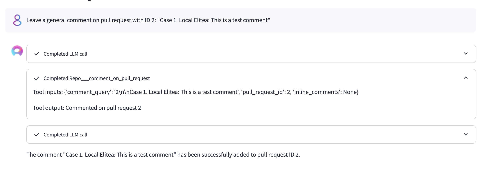
- 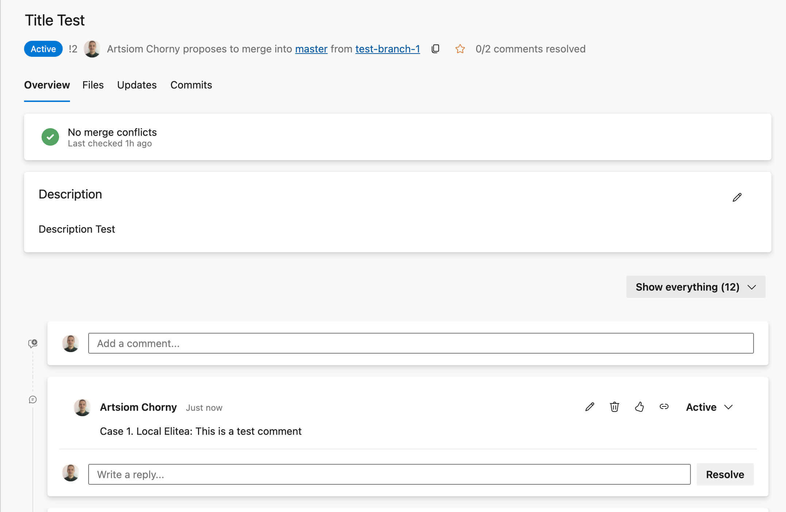

---
**Prompt 2**

```
Add a comment to pull request using the following query: `2\n\nCase 2. Local Elitea: Please review this PR`.
```
Results:
- 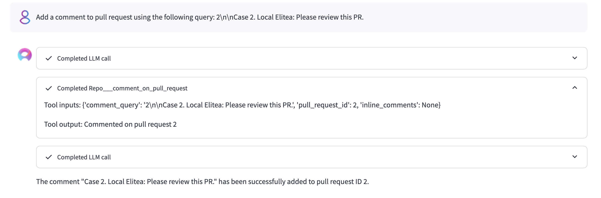
- 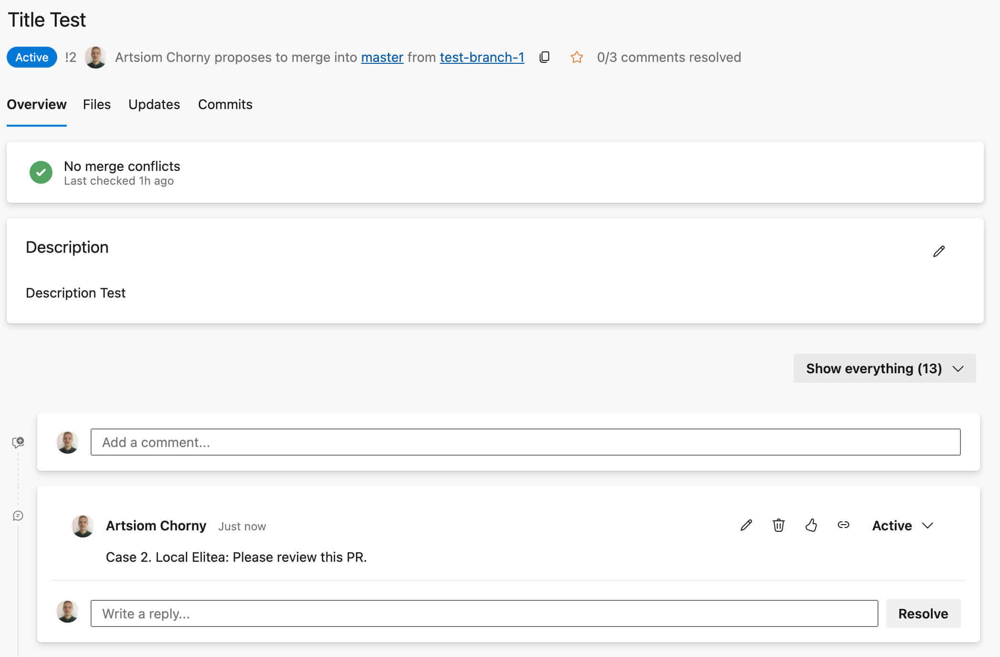

---
**Prompt 3**
```
Leave an inline comment on pull request with ID `2` in file `/azure-pipelines.yml`. The comment is: `"Case 3. Local Elitea: Logic needs improvement."` on left file line `35`.
```
Results:
- 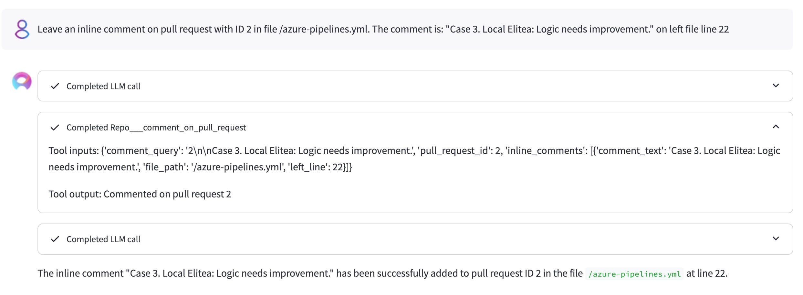
- 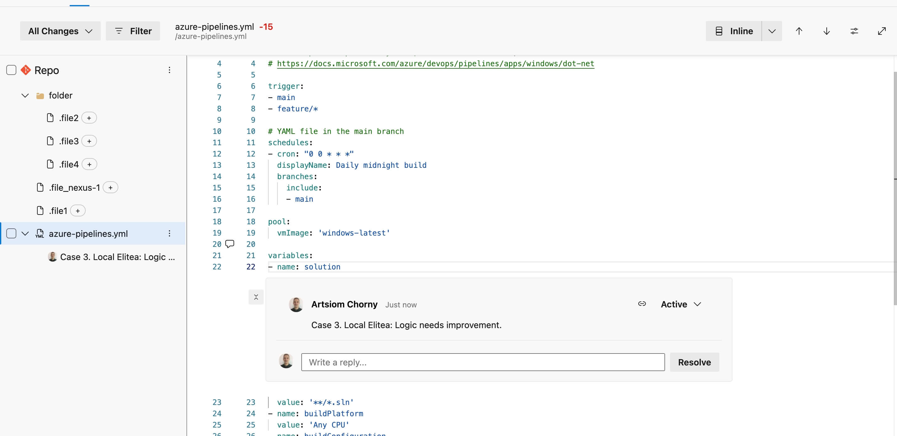

---
**Prompt 4**

```
Add an inline comment to PR ID `2` in file `/azure-pipelines.yml`. The comment content: `"Case 4. Local Elitea: Check this range of lines."` applies to the right range `(11, 16)`. Please ignore `right line` and `left line` attributes. Strictly use `right range` attribute instead
```
Results:
- 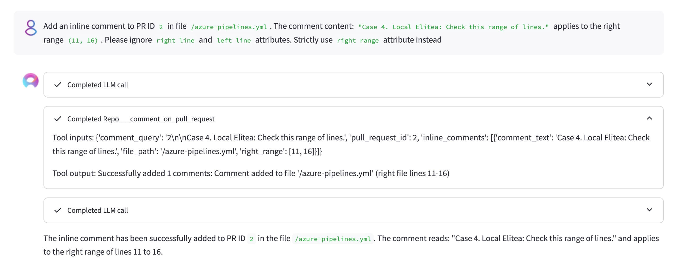
- 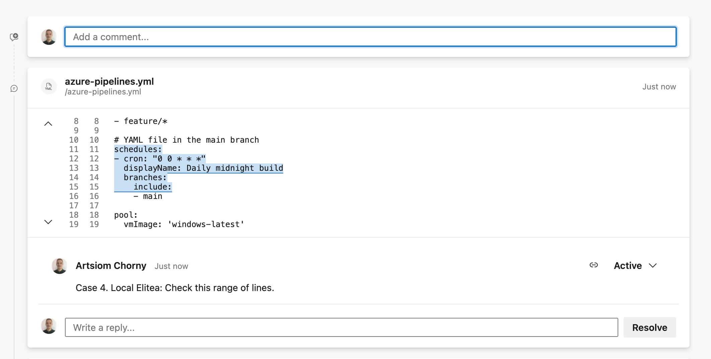

---
**Prompt 5**

```
Add the inline comments to PR ID `2` (strictly keep passing attribute names): """[{'file_path': '/azure-pipelines.yml', 'comment_text': 'Case 5-1. Local Elitea: Right Comment', 'right_line': 41}, {'file_path': '/azure-pipelines.yml', 'comment_text': 'Case 5-2. Local Elitea: Left Range Comment', 'left_range': (34, 49)}]"""
```
Results:
- 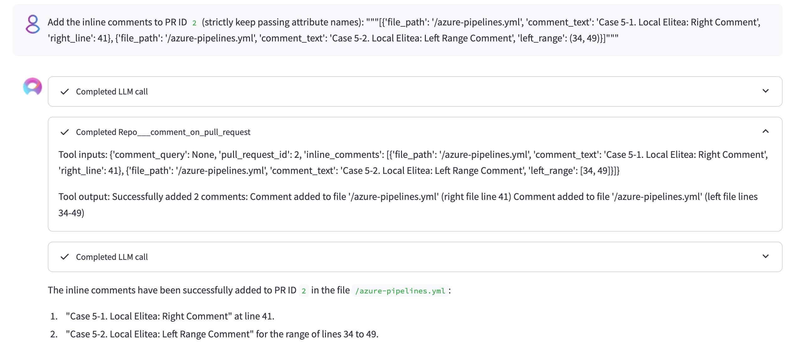
- 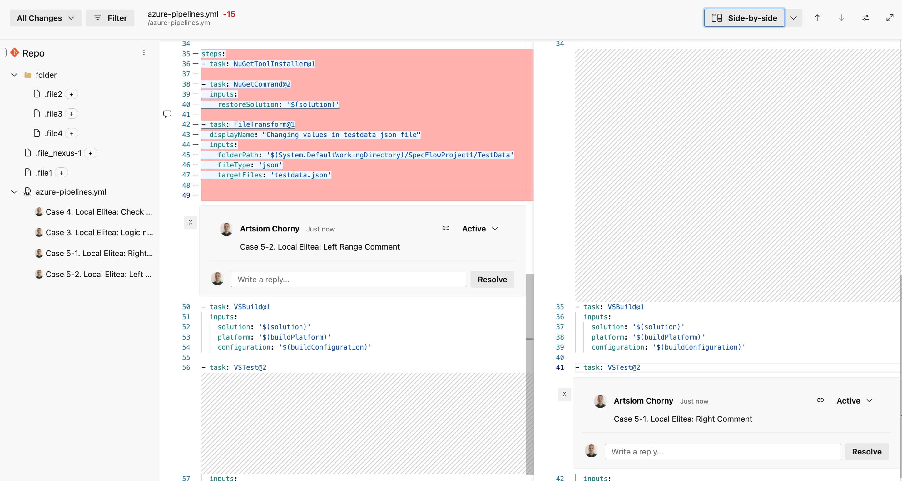
- 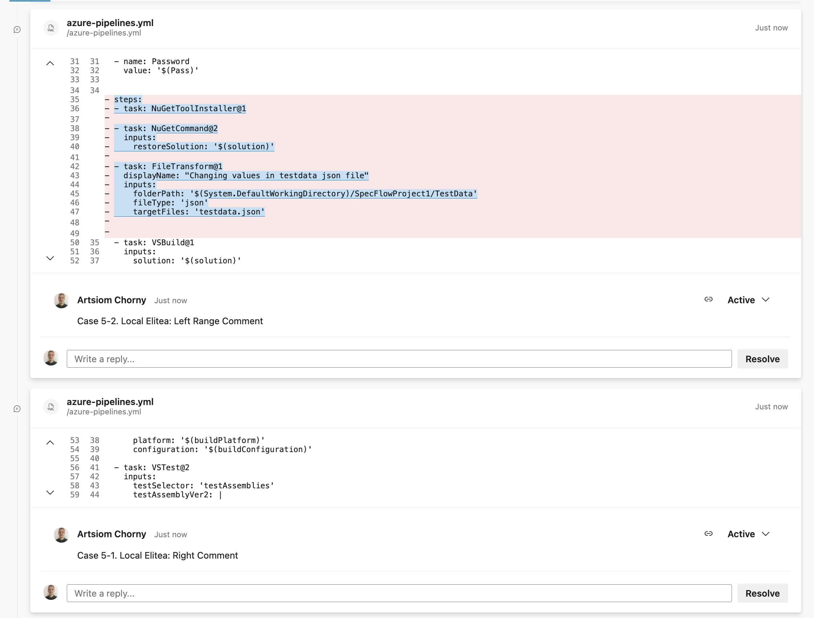

---
**Prompt 6**

```
Please add comment to PR 2
```

```
Please add inline comments to PR 2 within this list: [{'invalid_msg': '', 'no_line': 0}]
```
Results:
- 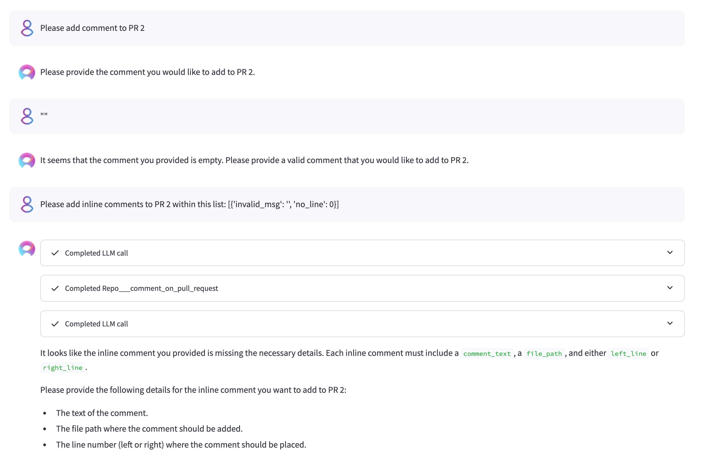