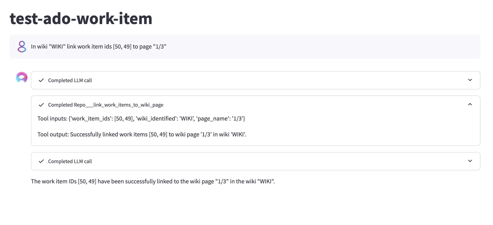
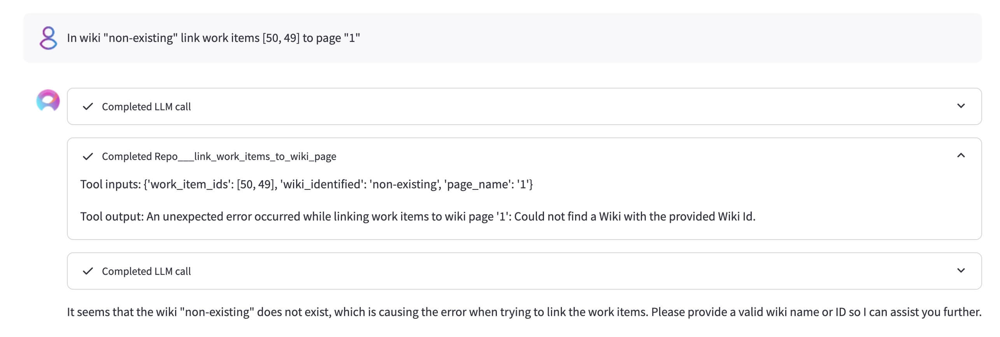
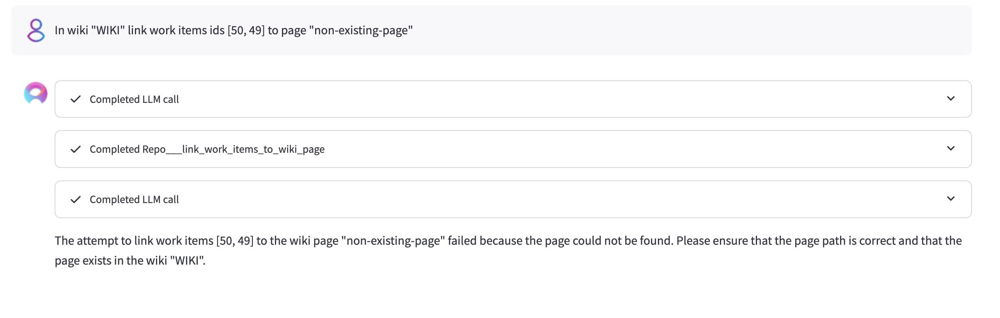
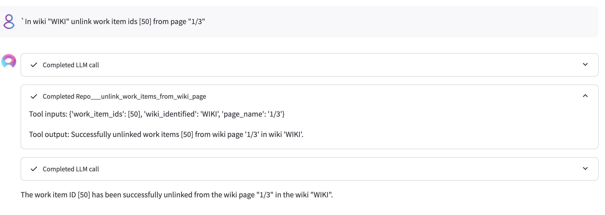

# ADO Work Item (Board)

### Link work items to wiki page

**Prompt 1**
```
In wiki "WIKI" link work item ids (50, 49] to page "1/3".
```
Results:
- 

---
**Prompt 2**

```
In wiki "non-existing" link work items [50, 49] to page "1".
```
Results:
- 

---
**Prompt 3**
```
In wiki "WIKI" link work items ids (50, 49] to page "non-existing-page".
```
Results:
- 

---
**Prompt 4**

```
In wiki "WIKI" link work items [50, 23423423] to page "1/3"
```
Results:
- 

---
**Prompt 5**

```
In wiki "WIKI" link work items [] to page "1/3"
```
Results:
- 


### Unlink work items from wiki page
---
**Prompt 6**

```
In wiki "WIKI" unlink work item ids [50] from page "1/3"
```

Results:
- 