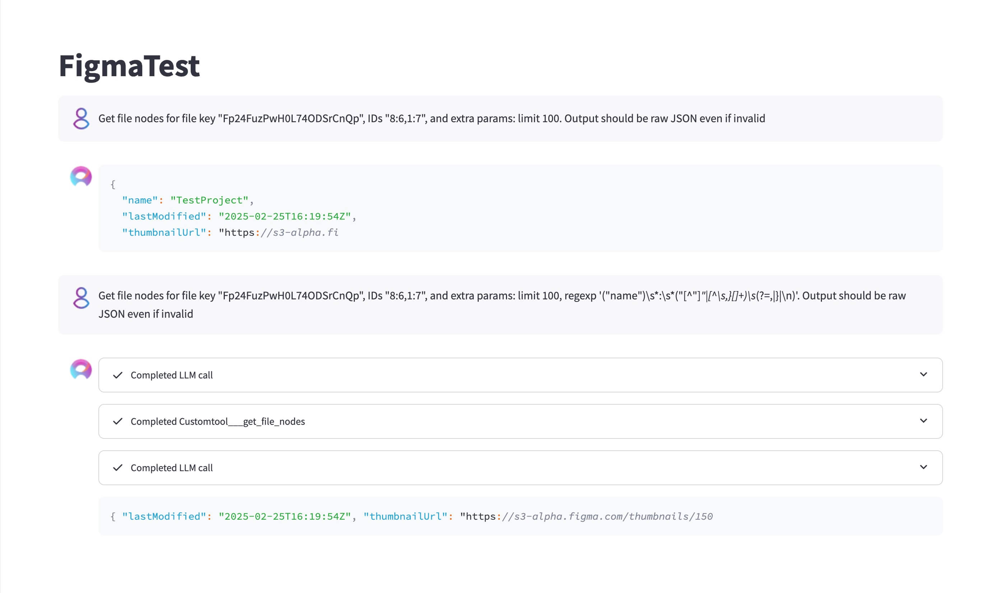
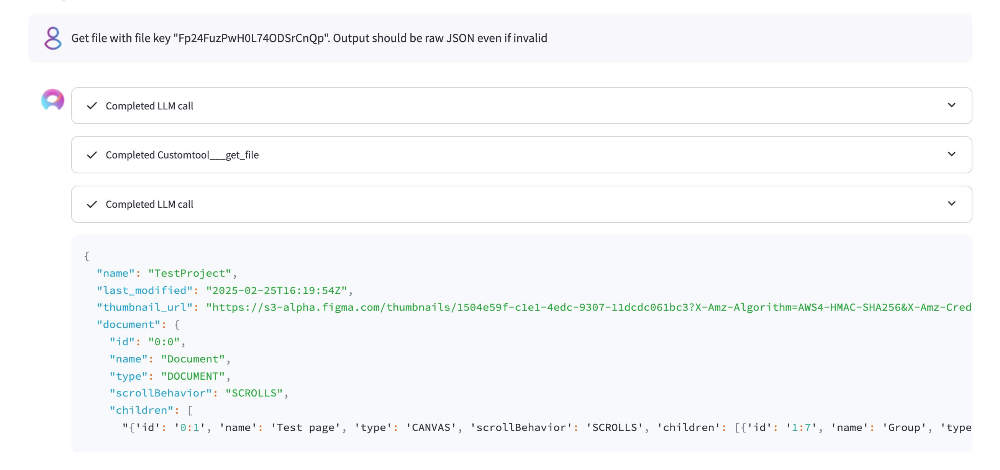
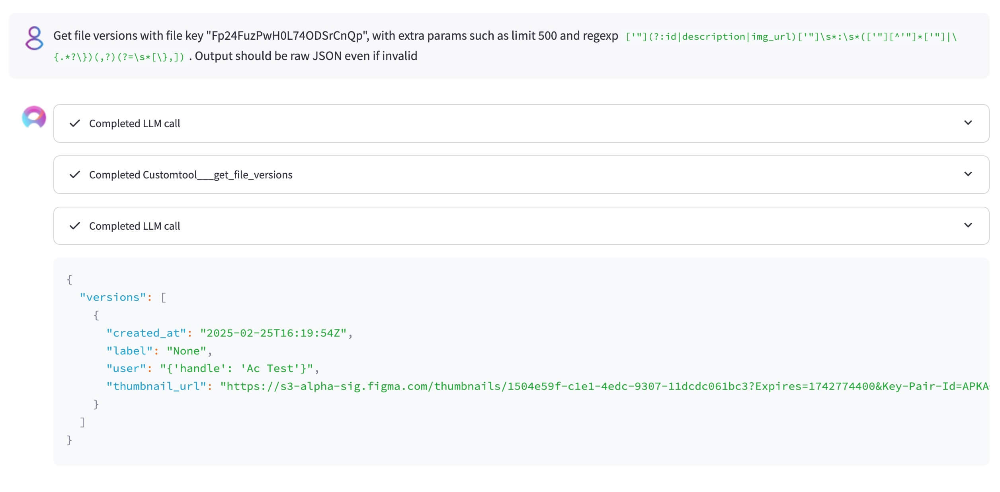
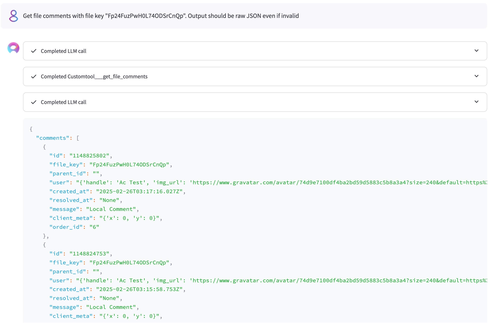
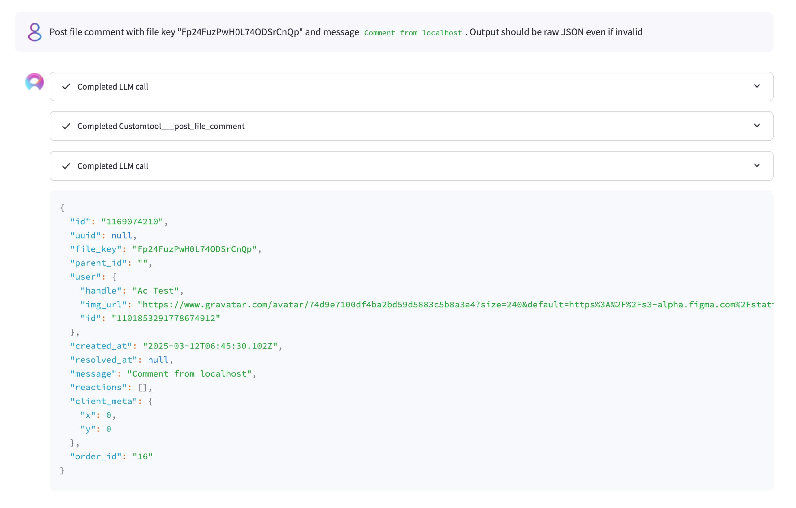
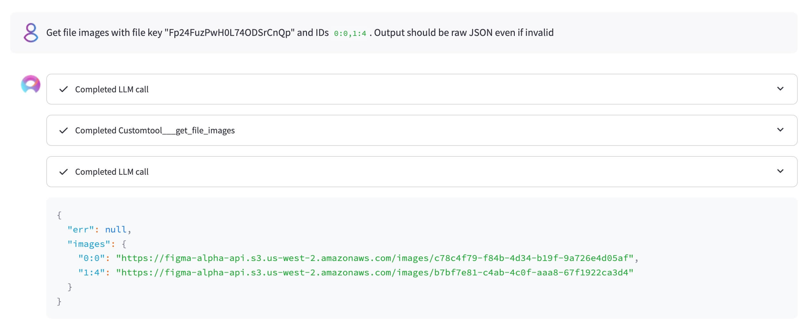
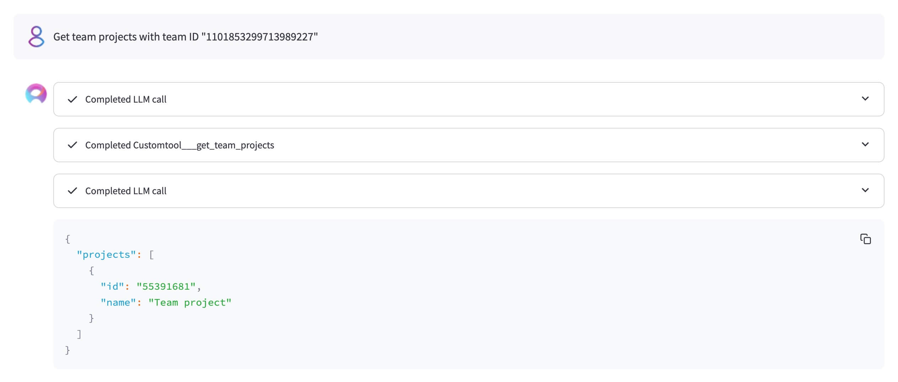
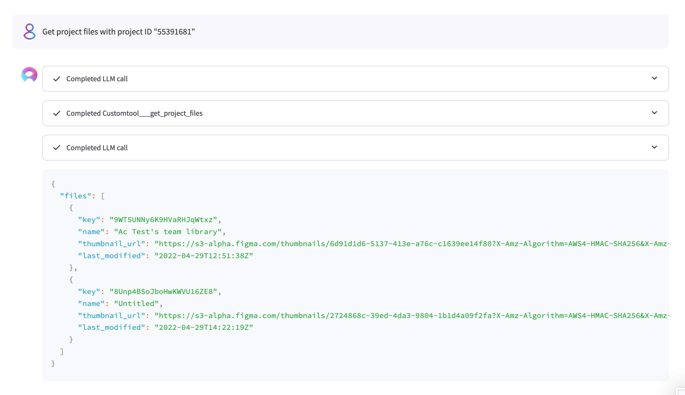

# Figma

### Prompts

1. Get File Nodes
- Prompt:
```
Get file nodes for file key "Fp24FuzPwH0L74ODSrCnQp", IDs "8:6,1:7", and extra params: limit 100, regexp '("name")\s*:\s*("[^"]"|[^\s,}[]+)\s(?=,|}|\n)'. Output should be raw JSON even if invalid
```
- Result:\


2. Get File
- Prompt:
```
Get file with file key "Fp24FuzPwH0L74ODSrCnQp". Output should be raw JSON even if invalid
```
- Result:\


3. Get File Versions
- Prompt:
```
Get file versions with file key "Fp24FuzPwH0L74ODSrCnQp", with extra params such as limit 500 and regexp `['"](?:id|description|img_url)['"]\s*:\s*(['"][^'"]*['"]|\{.*?\})(,?)(?=\s*[\},])`. Output should be raw JSON even if invalid
```
- Result:\


4. Get File Comments
- Prompt:
```
Get file comments with file key "Fp24FuzPwH0L74ODSrCnQp". Output should be raw JSON even if invalid
```
- Result:\


5. Post File Comment
- Prompt:
```
Post file comment with file key "Fp24FuzPwH0L74ODSrCnQp" and message `Comment from localhost`. Output should be raw JSON even if invalid
```
- Result:\


6. Get File Images
- Prompt:
```
Get file images with file key "Fp24FuzPwH0L74ODSrCnQp" and IDs `0:0,1:4`. Output should be raw JSON even if invalid
```
- Result:\


7. Get Team Projects
- Prompt:
```
Get team projects with team ID "1101853299713989227"
```
- Result:\


8. Get Project Files
- Prompt:
```
Get project files with project ID "55391681"
```
- Result:\
